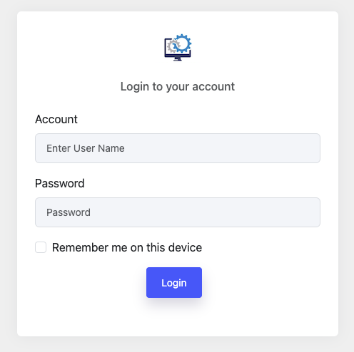
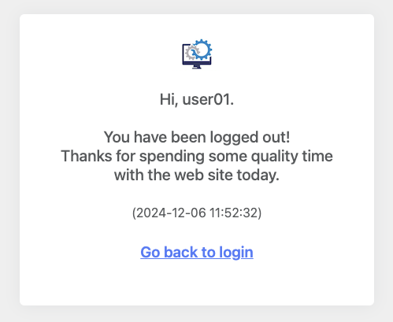
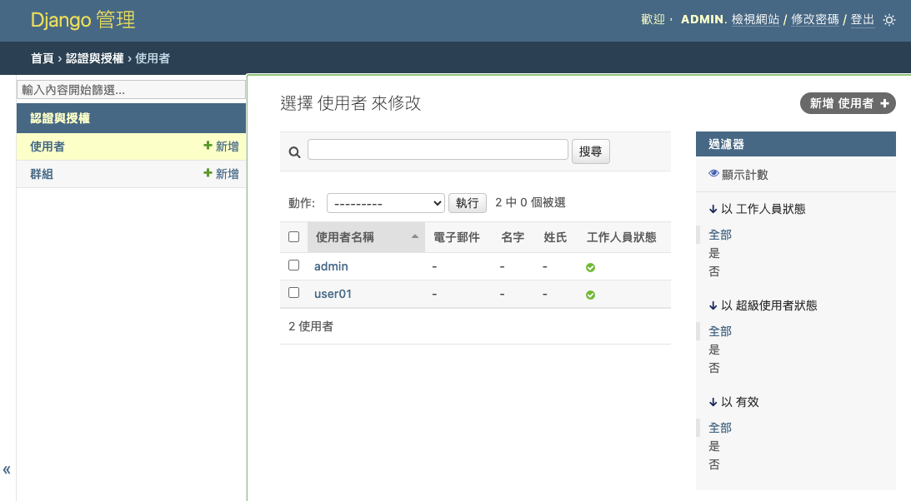
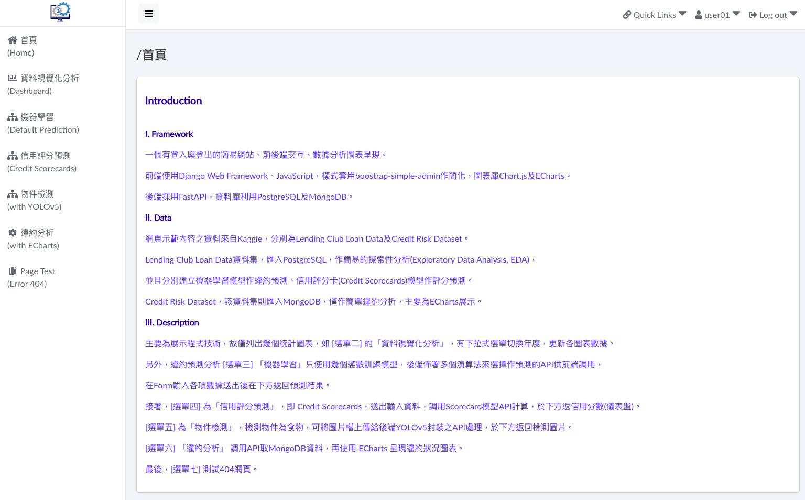
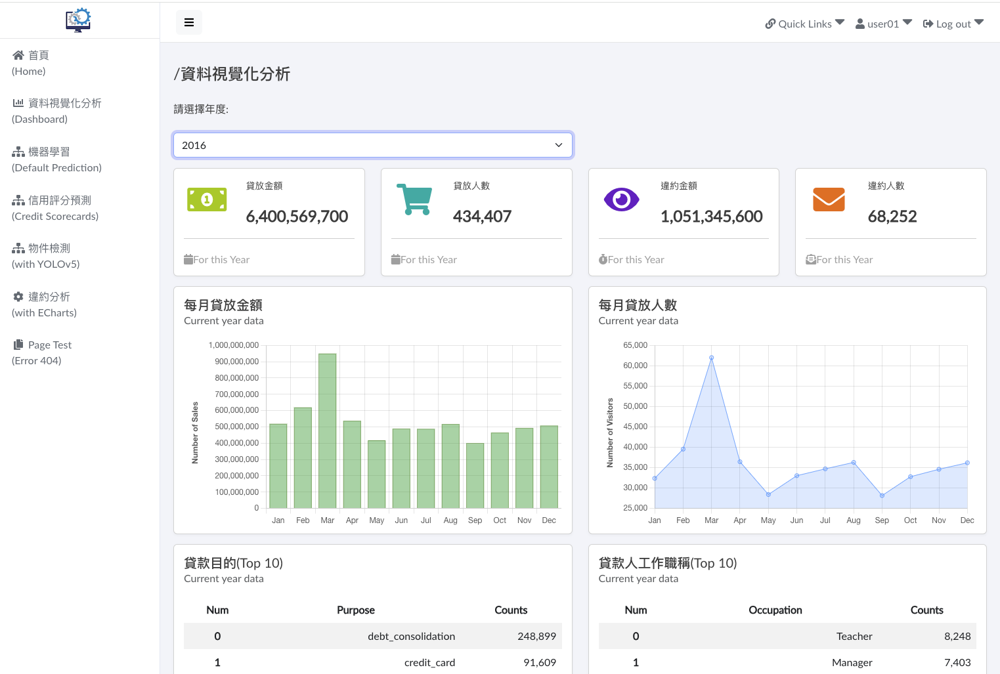
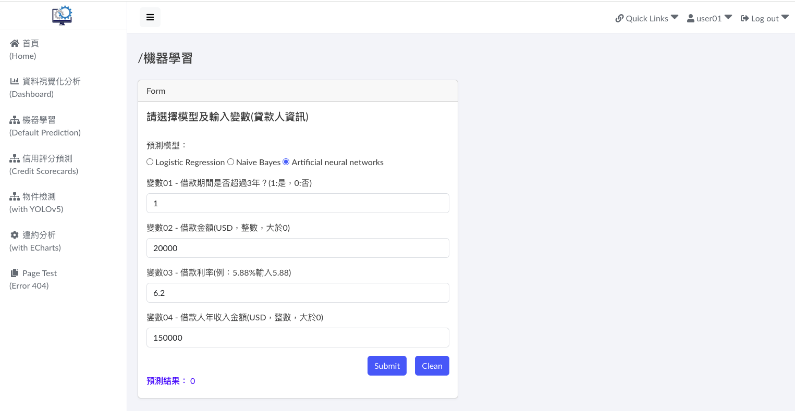
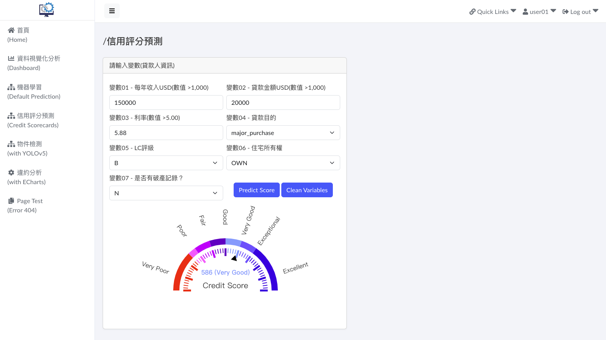
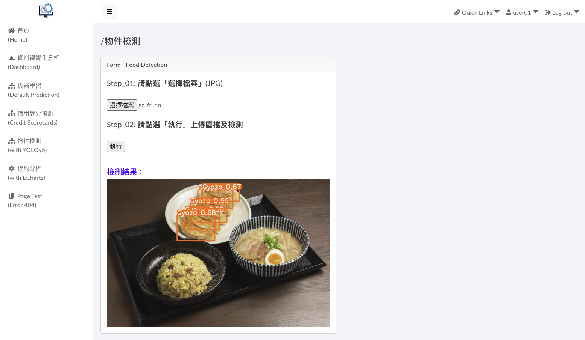
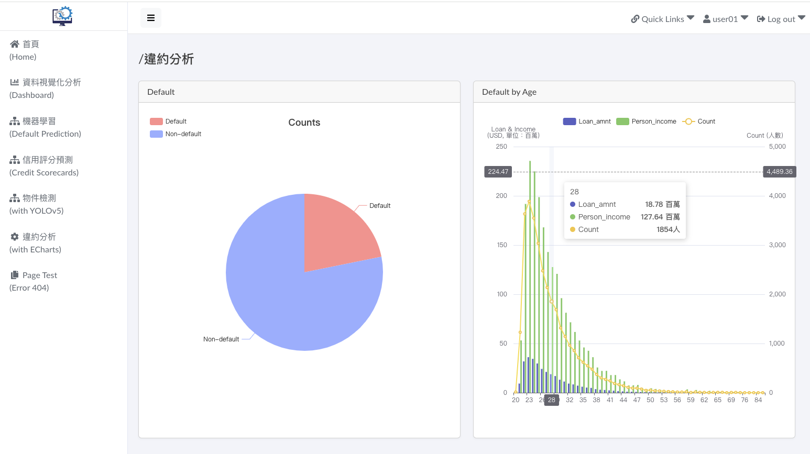
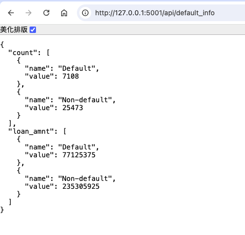

# **django_demo_01**

## **Django - 簡單網站展示**

#### **Ⅰ. 目的：** 
以Django框架實作簡單網站，瞭解目前掌握技術知識點，並配合過去所學結合機器學習及數據分析之應用。
  

#### **Ⅱ. 使用相關框架或套件：**
前端：Django、JavaScript、Boostrap、Chart.js、ECharts 
後端：FastAPI、PostgreSQL、MongoDB 
其他：Scikit-learn、YOLOv5 

#### **Ⅲ. 簡介：** 
1.前端使用Django web framework及JavaScript處理網頁，樣式套用Boostrap-simple-admin，圖表庫為Chart.js、ECharts。 
  後端則以FastAPI建立API操作資料庫PostgreSQL及MongoDB、處理資料及模型推論運算，供前端調用渲染網頁。 
  最後，由Docker Compose佈署前端、後端、資料庫及相關服務。  
2.網頁示範內容之資料來自Kaggle，分別為Lending Club Loan Data及Credit Risk Dataset。 Lending Club Loan Data資料集，匯入PostgreSQL，作簡易的探索性分析(Exploratory Data Analysis, EDA)，並且分別建立機器學習模型作違約預測、信用評分卡(Credit Scorecards)模型作評分預測。 Credit Risk Dataset，該資料集則匯入MongoDB，僅作簡單違約分析，主要為ECharts展示。  
3.主要為展示程式技術，故僅列出幾個統計圖表，如 [選單二] 的「資料視覺化分析」，下拉式選單切換年度更新各圖表數據。另外，違約預測分析 [選單三]「機器學習」後端佈署多個演算法來選擇作預測的API供前端調用，在Form輸入各項數據送出後在下方返回預測結果。接著，[選單四] 為「信用評分預測」，即 Credit Scorecards，送出輸入資料，調用模型API計算，於下方返回預測結果(分數、評級)。[選單五] 為「物件檢測」，檢測物件為食物，可將圖片檔上傳給後端YOLOv5封裝之API處理，於下方返回檢測圖片。[選單六] 「違約分析」 調用API取MongoDB資料，再使用 ECharts 呈現違約狀況圖表。[選單七] 為測試 - 404網頁。 

#### **Ⅳ. 網頁展示：**

(1) 登入、登出及Django自帶後台管理

(2)首頁
- 頁面為左方導覽列(Navbar)，右方呈現內容。樣式套用Bootsrap-simple-admin ([詳見](<https://github.com/pro-dev-ph/bootstrap-simple-admin-template>))作簡化。

 

(3)選單二 - 資料視覺化分析(儀表板) 

- 調用API從資料庫擷取數據處理後渲染網頁，圖表以Chart.js繪製，下拉式選單可切換分析年度。

(4)選單三 - 機器學習 

- 可點選演算法及填寫變數資料送出Form，調用模型API運算，預測結果返回網頁。 (1:可能會違約, 0:可能不會違約)

(5)選單四 - 信用評分預測(Credit Scorecards) 

- 填寫變數資料送出便開始調用模型API運算，預測結果(分數、評級)於下方以藍色文字及儀表盤呈現。 此處Credit Scorecards之模型訓練及推論為另一專案(credit_scorecards_demo_01  [詳見](<https://github.com/qinglian1105/credit_scorecards_demo_01/tree/main>))。

(6)選單五 - 物件檢測 

- 可上傳圖片檔，調用YOLOv5模型API作推論，檢測結果返回網頁。 此處目的僅是YOLO模型推論佈署之練習，引用之模型及內容 ([詳見](<https://medium.com/@auliyafirdaus03/step-by-step-deploy-yolov5-ultralytics-machine-learning-model-with-fastapi-ef6faacea4ee>))。另外，圖中食物截圖([詳見](<https://www.facebook.com/ohshotaiwan/posts/%E6%BC%A2%E7%A5%9E%E6%88%90%E5%8A%9F%E5%BA%97%E9%99%90%E5%AE%9A%E6%96%99%E7%90%86-%E5%A4%A7%E5%AE%B6%E4%BE%86%E9%A4%83%E5%AD%90%E3%81%AE%E7%8E%8B%E5%B0%87%E9%83%BD%E9%BB%9E%E4%BB%80%E9%BA%BC%E6%96%99%E7%90%86%E5%91%A2%E5%A6%82%E6%9E%9C%E6%AF%AB%E7%84%A1%E9%A0%AD%E7%B7%92%E7%9A%84%E8%A9%B1%E5%B0%8F%E7%B7%A8%E8%B6%85%E6%8E%A8%E8%96%A6%E6%96%B0%E6%89%8B%E5%85%A5%E9%96%80%E6%AC%BE%E7%8E%8B%E5%B0%87%E6%8B%89%E9%BA%B5%E5%A5%97%E9%A4%90%E7%8E%8B%E5%B0%87%E4%BA%BA%E6%B0%A3%E6%96%99%E7%90%86%E4%B8%80%E6%AC%A1%E6%94%B6%E9%9B%86%E7%8E%8B%E5%B0%87%E7%85%8E%E9%A4%83%E7%8E%8B%E5%B0%87%E7%82%92%E9%A3%AF%E7%8E%8B%E5%B0%87%E9%86%AC%E6%B2%B9%E8%B1%9A%E9%AA%A8%E6%8B%89%E9%BA%B5%E7%86%B1%E9%96%80%E8%8F%9C%E5%96%AE%E4%B8%80/380404612371913/>))。

(7)選單六 - 違約分析 

- 調用API取MongoDB資料，再使用 ECharts 呈現違約狀況圖表：違約佔比、違約年齡分佈。

(8)API接口 
- FastAPI建立不同功能的API接口，資料來自二個資料庫PostgreSQL及MongoDB，如："/api/default_info取得違約及非違約人數及金額，其他接口詳見程式碼(專案資料夾 DemoFastApi)。

 

---

#### **References**

[1] [Getting started with Django](<https://www.djangoproject.com/start/>)

[2] [pro-dev-ph/bootstrap-simple-admin-template](<https://github.com/pro-dev-ph/bootstrap-simple-admin-template>)

[3] [Chart.js](<https://www.chartjs.org/>)

[4] [Apache ECharts](<https://echarts.apache.org/zh/index.html>)

[5] [Lending Club Loan Data](<https://www.kaggle.com/datasets/adarshsng/lending-club-loan-data-csv/data>)

[6] [Credit Risk Dataset](<https://www.kaggle.com/datasets/laotse/credit-risk-dataset/data>)

[7] [Logistic Regression in Building Credit Scorecard](<https://medium.com/@rachmanto.rian/logistic-regression-in-building-credit-scorecard-924bece9f953>)

[8] [Step-by-Step: Deploy YOLOv5 Ultralytics Machine Learning Model with FastAPI](<https://medium.com/@auliyafirdaus03/step-by-step-deploy-yolov5-ultralytics-machine-learning-model-with-fastapi-ef6faacea4ee>)

[9] [餃子の王將—台灣的貼文](<https://www.facebook.com/ohshotaiwan/posts/%E6%BC%A2%E7%A5%9E%E6%88%90%E5%8A%9F%E5%BA%97%E9%99%90%E5%AE%9A%E6%96%99%E7%90%86-%E5%A4%A7%E5%AE%B6%E4%BE%86%E9%A4%83%E5%AD%90%E3%81%AE%E7%8E%8B%E5%B0%87%E9%83%BD%E9%BB%9E%E4%BB%80%E9%BA%BC%E6%96%99%E7%90%86%E5%91%A2%E5%A6%82%E6%9E%9C%E6%AF%AB%E7%84%A1%E9%A0%AD%E7%B7%92%E7%9A%84%E8%A9%B1%E5%B0%8F%E7%B7%A8%E8%B6%85%E6%8E%A8%E8%96%A6%E6%96%B0%E6%89%8B%E5%85%A5%E9%96%80%E6%AC%BE%E7%8E%8B%E5%B0%87%E6%8B%89%E9%BA%B5%E5%A5%97%E9%A4%90%E7%8E%8B%E5%B0%87%E4%BA%BA%E6%B0%A3%E6%96%99%E7%90%86%E4%B8%80%E6%AC%A1%E6%94%B6%E9%9B%86%E7%8E%8B%E5%B0%87%E7%85%8E%E9%A4%83%E7%8E%8B%E5%B0%87%E7%82%92%E9%A3%AF%E7%8E%8B%E5%B0%87%E9%86%AC%E6%B2%B9%E8%B1%9A%E9%AA%A8%E6%8B%89%E9%BA%B5%E7%86%B1%E9%96%80%E8%8F%9C%E5%96%AE%E4%B8%80/380404612371913/>)
